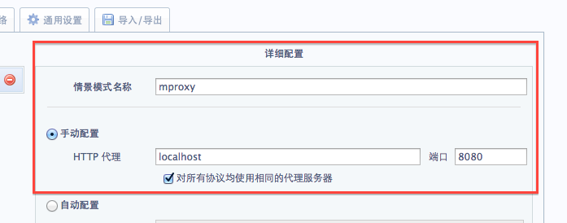
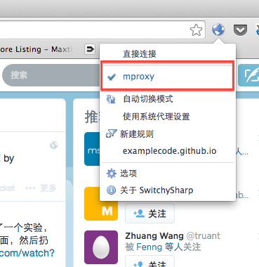

# mproxy 使用说明

这是一个微型的http代理服务器实现,使用c语言实现，核心代码量不足500行,不依赖任何第三方的库(只能工作在unixlike系统下面).
其主要功能如下：

* http代理
* 支持https隧道
* 支持简单加密隧道

注：本代码实现简陋，完成仓促，目前还停留在一个原型的阶段，经测试访问facebook,twitter,youtube ，google是OK的，但不保证所有的网站兼容性的问题，希望能够起到一个抛砖引玉的作用。欢迎提交pull request 继续完善. :)

通常情况下存在两种工作模式,普通代理模式和加密隧道模式.

## 普通代理

这种工作模式和普通的http代理一样，mproxy目前只做简单的http转发，不做任何页面的缓存。

## 加密隧道(翻墙专用)

这种工作模式需要以client,server的模式进行配合使用，即mproxy分别作为客户端和服务端，并在客户端及服务端形成一个简单的加密隧道,从而躲过GFW的侦测。具体的工作模式如下图所示:

 <pre>   
   +----------+        +-----------+       +----------+      +----------+
   |          |        |           |       |          |      |          |
   |          |        |           |       |          |      |          |
   |  APP     +------->| mproxy    |+------> mproxy   +------> Web      |
   |          |        |           |       |          |      |          |
   |          |        | client    |       | server   |      |          |
   +----------+        +-----------+       +----------+      +----------+
</pre>

## 编译

mproxy可以运行在unix-like 的操作系统下面，程序很小没有第三方的依赖，所以编译很简单，下面的一行命令搞定!

    gcc -o mproxy mproxy.c

## 使用方法

### 作为普通的代理服务器。

    ./mproxy -l 8000 -d

这种工作方式对我们来讲意义不大，只做功能展示，重点在下面。

注： "-d" 参数表示程序作为deamon服务，避免终端退出程序结束

### 作为加密隧道的部署方式(翻墙专用)

有翻墙需求的同学需要使用mproxy分别作为本地代理和远程代理，并且指定两个代理之间传输数据的方式为加密方式。 注：翻墙的话远程代理服务器需要部署在不受GFW管制的国外(找个便宜的VPS即可).

#### step1 : 在远程服务器启动mproxy作为远程代理

你需要把mproxy源码在远程的服务器编译(直接拷贝二进制应该也可以)然后运行下面的命令。

    ./mproxy  -l 8081 -D -d

-D 指定接受数据进行解密，其对应参数'-E'应用在本地代理
-d 指定启动作为后台服务，避免终端退出程序结束

#### step2 : 本地启动 mproxy 作为本地代理，并指定传输方式加密。

在本地启动一个mporxy 并指定目上一步在远程部署的服务器地址和端口号。

    ./mproxy  -l 8080 -h xxx.xxx.xxx.xxx:8081 -E

-l 指定本地监听端口
-h 指定远端下一跳步的服务器地址及端口号，如果翻墙需要是一台国外的服务器
-E 发送数据的时候进行加密，其对应参数'-D' 应用在远程代理

#### step3 : 配置浏览器http代理使用mporxy本地代理

设置你的浏览器http代理指向你的本地代理，使用chrome浏览器的同学强烈推荐使用
[switchSharp](https://code.google.com/p/switchysharp/)，安装完毕swichSharp以后只需要为switchSharp增加一个情景模式就好，如下图：

 

保存设置以后如果想翻墙的话就切换到你刚才配置的情景模式吧。

 

注： mproxy暂不支持windows用户，但是可以和已经部署好的机器共享，只需要在switchSharp中把代理服务器的地址从“localhost"改成已经部署好mproxy的ip即可。

